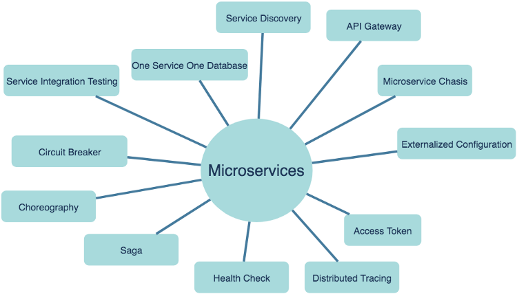

# Microservices

## What is Microservices?

The new architecture pattern is been adopted by almost all sizes of organizations, be it small, medium, or large.
Organizations have started realizing the value of it. In spite of such widespread adoption of this pattern, it's
unfortunate, there is no consistent definition of Microservices.

One of the early adopters of Microservices Architecture — _Netflix_ describes it as _"nothing but a fine-grained SOA
(Service-oriented Architecture)"_. Martin Fowler, the pioneer of software development, says — _"the microservice
architectural style is an approach to develop a single application as a suite of small services, each running in its own
process and communicating with lightweight mechanisms, often an HTTP resource API. These services are built around
business capabilities and independently deployable by fully automated deployment machinery."_

## Characteristics of Microservices

* Highly maintainable and testable
* Loosely coupled
* Independently deployable
* Organized around business capabilities
* Owned by a small team

## What do Microservices Offer?

* The foremost advantage of it is **improved maintainability**. Each service is relatively small and so is easier to
  understand, modify, and test.
* As each service is independent, you are free to choose a different technology stack for its development. This
  **eliminates any long-term commitment to technology**.
* As services are smaller, they can be **independently tested in a comparatively less time frame**. We do not need to
  wait for all the other modules to be validated before we push it for the next stage of deployment.
* One of the best offerings is **independent deployment**. This helps in faster delivery through continuous deployment.
* Software **development can be more organized into smaller, autonomous teams**. “small team” is a relative term though.
  Typically it consists of 5–10 people.
* Our application becomes more robust in terms of **fault tolerance**. If one service is down, it will not bring down
  other services (as was the case with monolith applications). Our application will still continue to serve other
  requests with **increased availability**.
* As the services can be deployed independently, we can scale-up or scale-down the service instances based on traffic.
  This **improves the overall scalability and availability** of our application significantly.

## Microservices Architecture

Here is the list of some widely used patterns in the microservices world —

* **Service decomposition** — This is the first step that helps in breaking down the monolith application into smaller
  services.
* **Service Discovery** — This pattern helps in discovering the service instances at runtime, as the instances carry
  dynamically assigned network addresses.
* **API gateway** — An API gateway separates external public APIs From internal microservice APIs

* **Microservices Chassis** — Deals with cross-cutting concerns like configuration, logging, health check, distributed
  tracing, etc
* **Containerization** — This deals with the docker containers to create a more isolated environment for deployment.
* **Circuit Breaker** — This pattern ensures the service failure does not propagate to the other services.
* **Service Mesh** — The pattern provides a separate infrastructure layer for microservices communication, implementing
  multiple patterns underneath including service discovery, load balancing, circuit breaker, gateway, and many others.
* **Choreography** — The pattern is used to facilitate the complex interaction of services among themselves, especially
  in data pipelines.
* **Saga** — The pattern helps in implementing a single transaction spanned across multiple services.
* **Auto-scalability** — This helps in automatically scaling up or scaling down a particular microservice. Load
  balancing, Fault Tolerance adds up to the complexity.
* **Access Token** — Services interact with each other through access token validations.

## Challenges of Microservices Architecture

Microservice architecture is more complex than the legacy system. The microservice environment becomes more complicated
because the team has to manage and support many moving parts. Here are some of the top challenges that an organization
face in their microservices journey:

* **Bounded context**: The bounded context concept originated in Domain-Driven Design (DDD) circles. It promotes the
  Object model first approach to service, defining a data model that service is responsible for and is bound to. A
  bounded context clarifies, encapsulates, and defines the specific responsibility to the model. It ensures that the
  domain will not be distracted from the outside. Each model must have a context implicitly defined within a sub-domain,
  and every context defines boundaries.
* **In other** words, the service owns its data and is responsible for its integrity and mutability. It supports the
  most important feature of microservices, which is independence and decoupling.
* **Dynamic scale** up and scale down: The loads on the different microservices may be at a different instance of the
  type. As well as auto-scaling up your microservice should auto-scale down. It reduces the cost of the microservices.
  We can distribute the load dynamically.
* **Monitoring:** The traditional way of monitoring will not align well with microservices because we have multiple
  services making up the same functionality previously supported by a single application. When an error arises in the
  application, finding the root cause can be challenging.
* **Fault Tolerance**: Fault tolerance is the individual service that does not bring down the overall system. The
  application can operate at a certain degree of satisfaction when the failure occurs. Without fault tolerance, a single
  failure in the system may cause a total breakdown. The circuit breaker can achieve fault tolerance. The circuit
  breaker is a pattern that wraps the request to external service and detects when they are faulty. Microservices need
  to tolerate both internal and external failure.
* **Cyclic Dependency**: Dependency management across different services, and its functionality is very important. The
  cyclic dependency can create a problem, if not identified and resolved promptly.
* **DevOps Culture**: Microservices fits perfectly into the DevOps. It provides faster delivery service, visibility
  across data, and cost-effective data. It can extend their use of containerization switch from
  Service-Oriented-Architecture (SOA) to Microservice Architecture (MSA).
  ### _Other challenges_
    - As we add more microservices, we have to be sure they can scale together. More granularity means more moving
      parts, which increase complexity.
    - The traditional logging is ineffective because microservices are stateless, distributed, and independent. The
      logging must be able to correlate events across several platforms.
    - When more services interact with each other, the possibility of failure also increases.

## Microservices Architecture vs SOA

|  **Microservice Based Architecture (MSA)** |  **Service-Oriented Architecture (SOA)** |
|---|---|
| Microservices uses lightweight protocols such as **REST**, and **
HTTP**, etc.  | SOA supports multi-message protocols.  |
| It focuses on **decoupling**.  | It focuses on application service **reusability**.  |
|  It uses a **simple messaging system** for communication. |  It uses **Enterprise Service Bus (ESB)** for communication. |
|  Microservices follows "**share as little as possible**" architecture approach. |  SOA follows "**share as much as possible architecture**" approach |
|  Microservices are much **better in faulttolerance** in comparison to SOA. | SOA is not better in fault tolerance in comparison to MSA.  |
| Each microservice have an **independent database**. | SOA services share the whole data storage. |
| MSA used modern relational databases.| SOA used traditional relational databases.|
| MSA tries to minimize sharing through bounded context (the coupling of components and its data as a single unit with minimal dependencies)| SOA enhances component sharing.|
| It is better suited for the **smaller and well portioned, web-based system**.| It is better for a **large and complex business application** environment.|

## Microservices Monitoring

Monitoring is the control system of the microservices. As the microservices are more complex and harder to understand
its performance and troubleshoot the problems. Given the vivid changes to software delivery, it is required to monitor
the service. There are five principles of monitoring microservices, as follows:

- Monitor container and what's inside them.
- Alert on service performance.
- Monitor services that are elastic and multi-location.
- Monitor APIs.
- Monitor the organizational structure. These principles allow us to address technological changes associated with the
  microservices and organizational changes related to them.

### Microservices Monitoring Tool

There are three monitoring tools are as follows:

- Hystrix dashboard
- Eureka admin dashboard
- Spring boot admin dashboard

### Microservice Virtualization

Microservices virtualization is the method to simulate the behavior of specific components in various component-based
application like cloud-based application, SOA, and API driven architecture. Service virtualization also reduces cost and
save time. By combining service virtualization, an organization can develop the application which can be delivered from
various locations and dissimilar environments.

## Components of a Spring based Microservices

### Spring Cloud Config Server

Spring Cloud Config Server provides the HTTP resource-based API for external configuration in the distributed system. We
can enable the Spring Cloud Config Server by using the annotation @EnableConfigServer.

### Netflix Eureka Naming Server

Netflix Eureka Server is a discovery server. It provides the REST interface to the outside for communicating with it. A
microservice after coming up, register itself as a discovery client. The Eureka server also has another software module
called Eureka Client. Eureka client interacts with the Eureka server for service discovery. The Eureka client also
balances the client requests.

### Hystrix Server

Hystrix server acts as a fault-tolerance robust system. It is used to avoid complete failure of an application. It does
this by using the Circuit Breaker mechanism. If the application is running without any issue, the circuit remains
closed. If there is an error encountered in the application, the Hystrix Server opens the circuit. The Hystrix server
stops the further request to calling service. It provides a highly robust system.

### Netflix Zuul API Gateway Server

Netflix Zuul Server is a gateway server from where all the client request has passed through. It acts as a unified
interface to a client. It also has an inbuilt load balancer to load the balance of all incoming request from the client.

### Netflix Ribbon

Netflix Ribbon is the client-side Inter-Process Communication (IPC) library. It provides the client-side balancing
algorithm. It uses a Round Robin Load Balancing:

- Load balancing
- Fault tolerance
- Multiple protocols(HTTP, TCP, UDP)
- Caching and Batching

### Zipkin Distributed Server

Zipkin is an open-source project m project. That provides a mechanism for sending, receiving, and visualization traces.

_One thing you need to be focused on that is port number :_

|Application|Port|
|---|---|
|Spring Cloud Config Server|8888|
|Netflix Eureka Naming Server|8761|
|Netflix Zuul API gateway Server|8765|
|Zipkin distributed Tracing Server|9411|

